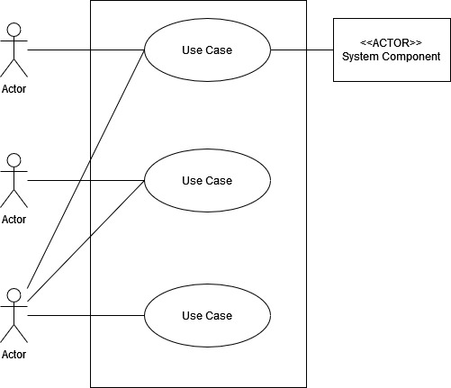
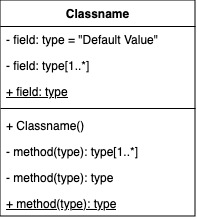
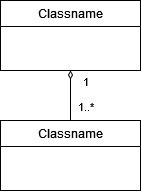

# Notes

## Ch. 1 Object-Oriented Fundamentals

* The biggest advantage of OO is code reusability - you can mix and match objects you've already create when new scenarios come up. 
* We use small simple examples to learn in the classroom but the real value of OO is once your codebase grows in scale. 

* Objects
    * Identity (ex: a particular instance)
    * Attributes - what are its properties?
        * Attributes that don't change
        * Attributes that change
    * Behaviors - what can it do?

> Objects are _self-contained_. They have their own identities, separate from other objects. 

Tangible objects (ex: Coffee mug) make for obvious objects. But more abstract, intangible things (ex: EventManager) aren't do intuitive. 

Rule of thumb: Is it a noun?

* Nouns don't have to be physical things
* Could you put "the" in front of it? The mug, the bank account, the event

Think of a class as a template of an object (metaphor: cookie cutter)

* Class
    * Name - what is it? (Aka type)
    * Attributes (Aka properties, data)
    * Behaviors (Aka operations, methods)

Methods vs. Functions - methods are functions that are part of a class

_Abstraction_ - Ignoring specific, detailed characteristics and choose to only focus on the essential qualities of an idea.

> What _should_ an object look like, for this application, under these circumstances, at this time? Focus on just the essentials.

It might be true that every person has a height, but if my application doesn't care about that, I don't need that to be part of my class. 

_Encapsulation_ - walling of the contents of a class from the code outside of it, in order to protect it and prevent corrupted data/logic.

> An object should make aspects of itself available only when it is absolutely necessary 

Benefit: by walling off implementation details, you can alter the implementation without having the change the rest of the application. 

Encapsulation is about reducing dependencies. Encapsulate as much as possible. 

_Inheritance_ - allowing some new class to receive the attributes and methods of an existing class. Benefit: code reuse.

_Dynamic Polymorphism_ - (Aka Runtime Polymorphism) Uses method overriding, acceping different types of objects that share the same method signatures at runtime. (You can do this with inheritance, interfaces, or abstract base classes)

_Static Polymorphism_ - Uses method overloading to achieve different behaviors given different inputs 

OO Analysis, OO Design, OO Programming

1. Analysis - understand the problem. What's the problem you're trying to solve? 
2. Design - plan your solution. How are you going to solve this problem? 
3. Programming - build your solution. Solving the problem.

Approach 

1. Requirements gathering
2. Define
3. Identify objects
4. Describing the interactions between objects 
5. Diagram 

**Unified Modeling Language (UML)** 

 

## Ch. 2 Requirements

* Functional requirements - what does it need to do? _The system must do..._
* Non-functional requirements - legal, performance, support, security. _The system should be..._

FURPS Requirements

* Functionality
* Usability
* Reliability
* Performance
* Supportability

FURPS+
* Design 
* Implementation
* Interface
* Physical

## Ch. 3 Use Cases

Use Cases
1. Title - keep it short
2. Actor (Human, or computer system)
3. Success Scenario - written as a regular paragraph, a list of steps, etc.

"Fully-dressed" use cases - many additional categories written out (can add bloat) 

* Who does system administration? 
* Who manages users and security? 
* What happens if the system fails? 
* Is anyone watching the system? 

Use Case Diagram 

User Stories

As a [type of user], I want [some goal], so that [some desired outcome].

* User stories should not contain implementation details
* User stories should not contain user interface details 

## Ch. 4 Domain Modeling 

Conceptual Model

1. Identify the objects - look at all the nouns.
2. Identify class relationships
3. Identify class responsibilities - who's job (which class) is it do each thing?

> Avoid objects that know too much or do too much (i.e. god object).

> An object should be responsible for itself as much as possible. This makes maintaining and updating your application easier.

CRC Cards (Class-Responsibility-Collaboration)

## Ch. 5 Class Diagrams 

A simple class diagram:

A more filled-out class diagram:

`+` means the member is public

`-` means the member is private

Underlined means the member is static

The `[1..*]` suffix means the type is a collection of multilple items of that type. Ex: String[1..*] means some String collection whether that be a `String[]` or a `List<String>`, etc.

> Leave as many class members private as possible

## Ch. 6 Inheritance and Composition 

Should A inherit from B? Check the statement: A _is_ a B. Or, A _is a type of_ B.

_Abstract class_ - made to be inherited and cannot be instantiated. 
_Concrete class_ - made to be instantiated and cannot be inherited. Also known as final, and sealed.

In UML class diagrams, abstract classes are donoted by italicizing the classname.

How to show inheritance in UML: 

Interfaces vs. Abstract Classes

* An interface represents a _capability_ a class has 
* An abstract class represents a _type_ that another class can inherit from 

How to show that a class implements an interface in UML: 

> _"Program to an interface, not an implementation."_

_Aggregation_ - When a class "has a" other class. Also: "Contains a...", "Uses a...", "Uses many...". 

In UML, aggregation is denoted with a diamond at the end of the arrow: 

Composition vs. Aggregation 

In aggregation, when the container object is destroyed, the contained object lives on. 

In composition, when the container object is destroyed, the contained object is also destroyed. 

In UML, you show composition using a solid diamond at the end of the arrow: 

